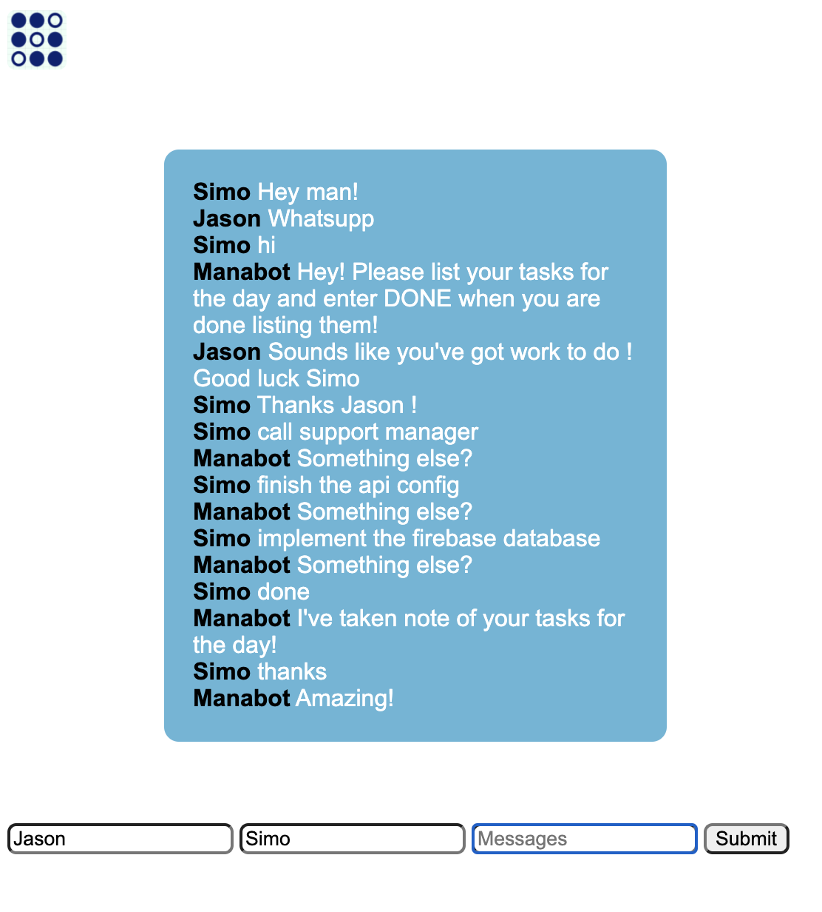

# Manabot

Your AI chat-based project manager

## Inspiration
The growing need of project managers and a social network for the work place

## What it does
Helps you organize your day and tasks and serves as an encrypted social network between you and your co-workers but also with the ai chatbot!
It also learns from its mistake by retraining according to user input!

## How we built it
Python for the backend and trained a sequential neural network using tensor flow
then flask to connect it to a webpage and socket to have a fluid and dynamic convo between the ai bot and your co-workers

## Challenges we ran into
Connecting socketio and training the model for all the different options and then basing actions on those different options

## Accomplishments that we're proud of
It works really well for a prototype and I'm happy that its autolearn function works !

## What we learned
Learned a lot !
Learned to use flask, socketio and tensor flow

## What's next for ManaBot 
More options, more data, more customization, and most importantly authentication using firebase!

## To run:
Go to the folder where chatbot.py is saved on the command line
then enter "python chatbot.py"
Make sure you have flask installed !

